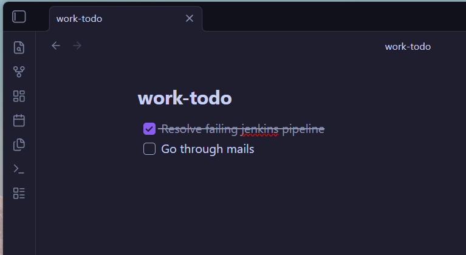

# recall

A fast terminal-based note-taking app written in Rust. Notes are stored as plain markdown — compatible with Obsidian.



## Features

- **Quick capture** — append notes from the command line in seconds
- **Fullscreen TUI** — browse and manage notes with keyboard navigation
- **Multiple notebooks** — organize notes into separate files with shorthand aliases
- **Done state** — toggle notes as completed, persisted immediately
- **Obsidian-compatible** — notes are markdown checkboxes with timestamps

## Installation

```sh
cargo build --release
```

The binary will be at `target/release/recall` (or `target/release/recall.exe` on Windows).

For quick access, add an alias:

```sh
alias r=recall
```

## Usage

### Add a note to the default notebook

```sh
recall buy groceries
recall fix the login bug
```

### Browse notes (TUI)

```sh
recall
```

Opens a fullscreen terminal UI where you can navigate and manage notes.

| Key     | Action        |
|---------|---------------|
| `j`/`↓` | Move down     |
| `k`/`↑` | Move up       |
| `d`     | Toggle done   |
| `q`/`Esc` | Quit        |

### Multiple notebooks

Use notebook aliases to target different files:

```sh
recall w meeting at 3pm    # adds to work notebook
recall p call dentist       # adds to personal notebook
recall w                    # opens work notebook in TUI
```

## Configuration

Configuration is optional. Create `~/.recall/config.toml`:

```toml
file = "~/.recall/notes.md"

[notebooks]
w = "~/notes/work.md"
p = "~/notes/personal.md"
j = "~/journal/daily.md"
```

If no config file exists, `recall` uses `~/.recall/notes.md` as the default notebook.

## Storage Format

Notes are stored as markdown checkboxes with inline timestamps:

```markdown
- [ ] 2026-03-28 14:30:00 buy groceries
- [x] 2026-03-28 09:00:00 send weekly report
- [ ] 2026-03-27 18:45:00 fix the login bug #urgent
```

Each note is a single line — compatible with Obsidian strikethrough rendering for completed items.

## Project Structure

```
src/
├── main.rs    # CLI entry point and command dispatch
├── note.rs    # Note data model and markdown parsing
├── storage.rs # File I/O for reading and writing notes
├── tui.rs     # Fullscreen terminal UI (ratatui)
├── config.rs  # TOML configuration and path resolution
└── lib.rs     # Module declarations
```

## Running Tests

```sh
cargo test
```
